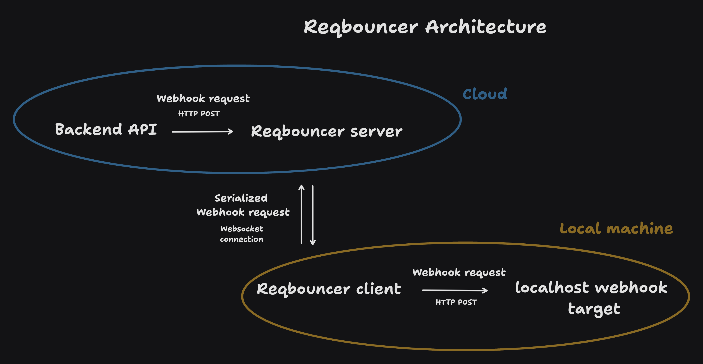

# reqbouncer

Reqbouncer is a powerful, easy-to-use tool designed to forward events from one source to another. It consists of two main components: a server element that is deployed in the cloud, and a client instance that runs locally.

The server element acts as a central relay point, receiving requests from various sources and forwarding them to the appropriate destinations. It is designed to be highly scalable and can handle a large number of concurrent connections, making it suitable for use in high-traffic environments.

The client instance of reqbouncer runs on your local machine and connects to the a cloud server instance of reqbouncer. It listens for incoming requests and forwards them to a local server endpoint. This allows you to expose a local web server to the internet, making it accessible from anywhere.

Reqbouncer operates similarly to tools like ngrok, providing a secure tunnel for HTTP traffic from your localhost to the internet. This is particularly useful for developers who need to test webhooks, APIs, or other web services that require a public URL.

With reqbouncer, you can easily create a secure, reliable connection between your local development environment and the outside world. This makes it an invaluable tool for modern web development workflows.

To use reqbouncer, you first need to deploy a cloud-accessible instance of the reqbouncer server. This server will act as the relay point for forwarding requests from your local machine to the internet.

Once the server is set up and accessible, you can install the reqbouncer binary on your local machine. You can then run the binary with a simple command, specifying the host (the address of your cloud server) and a secret token. This starts a forwarding listener that connects to the specified server and forwards all incoming requests to a local server.

Reqbouncer also provides a convenient configuration command that creates a local configuration file. This file contains settings like the secret token and server host, allowing you to easily customize the behavior of the reqbouncer client.

In summary, reqbouncer is a versatile tool that simplifies the process of forwarding requests from a local development environment to the internet. Whether you're testing a new API, setting up webhooks, or just need to expose a local web server to the internet, reqbouncer has you covered.



## Usage (Server)

You can either run the server as a binary or as a docker container.


Run the server with the following command:

```bash
reqbouncer server --secret-token 'my-secret-token' --port 8000
```

This will start the server on port 8000 and require a secret token for authentication. You can then use the server to forward requests from your local machine to the internet.


If you prefer to run the server as a docker container, you can use the following command:

```bash
docker run -p 8000:8000 -e REQBOUNCER_SECRET_TOKEN='my-secret-token' ghcr.io/znowdev/reqbouncer
```

## Usage (Client)

First install the reqbouncer binary:

```bash
go install github.com/znowdev/reqbouncer@latest
```

Then you can run the binary with the following command:

```bash
reqbouncer forward --host reqbouncerhost.com:443 --secret-token "my-secret-token" 4000
```

This will start a forwarding listener that connects to the `reqbouncerhost.com:443` server and forwards all incoming requests to the `http://localhost:4000` server.


### Configuration

The client can be configured locally by running the following command:

```bash
reqbouncer configure
```

This will create a `~/.reqbouncer/config` file in the user home directory with the following content:

```bash
secret_token="my secret token"
server_host="host:port"
```


### Install

You can also install the reqbouncer binary by running the following command:

```bash
bash -c "$(curl -fsSL https://raw.githubusercontent.com/znowdev/reqbouncer/master/setup.sh)"